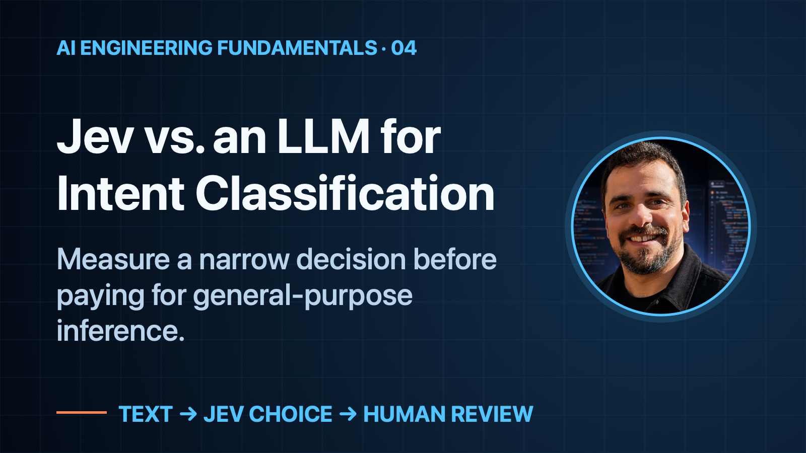
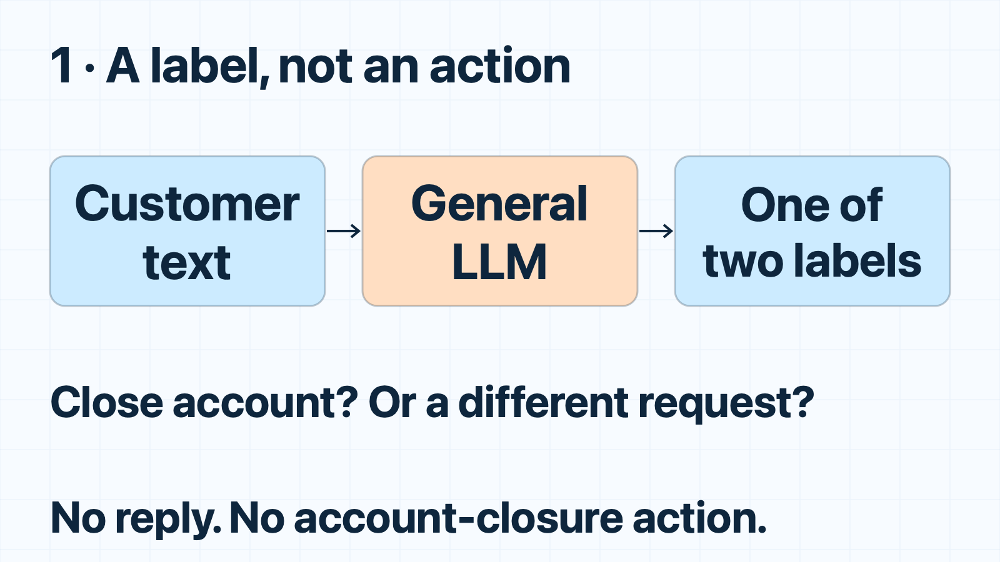
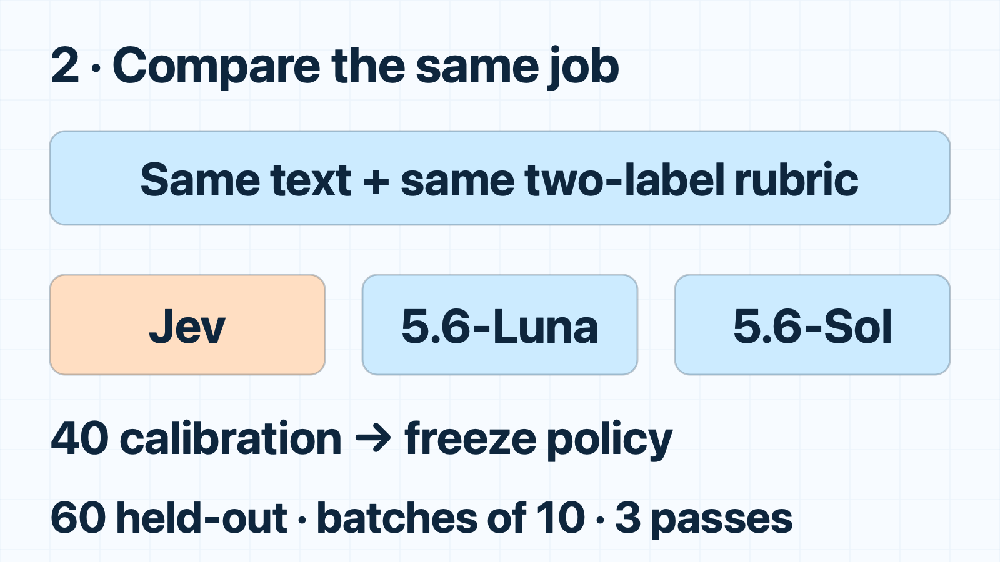
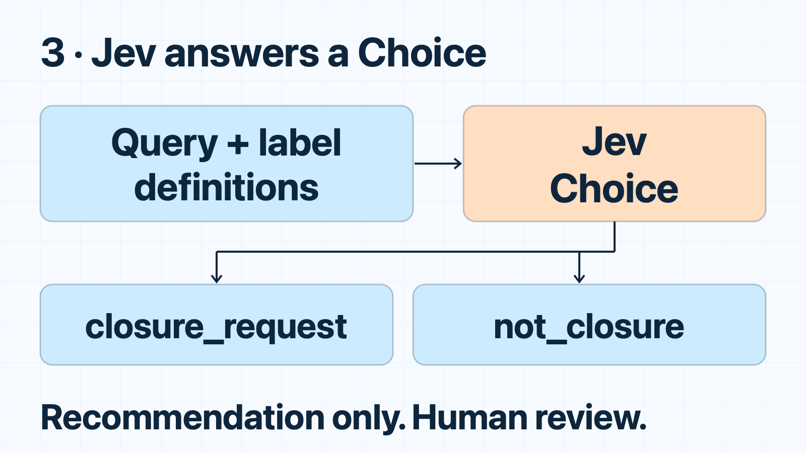

# Jev vs. an LLM for Intent Classification

*Measure a narrow decision before paying for general-purpose inference.*

**When to use this:** Your application needs a small semantic decision, not a generated answer. Compare a focused classifier with your LLM on the same inputs before changing the workflow.

## Two cancellations, two different requests

“I want to cancel my banking account.”

“I am keeping this account. How can I cancel a transfer?”

Both mention cancellation. Only one asks to close the account. A keyword match is a starting point, but the object and the customer’s intent matter.

Do you need a general-purpose LLM to make that distinction?

[Jev](https://docs.typesafe.ai/introduction) is TypeSafe’s model for focused decisions. You supply evidence and define the possible answers. I tested whether it could perform this small classification job faster and at a lower estimated cost than two LLM integrations—without losing observed accuracy.

## Step 1 — define the decision, not an action

The baseline asks an LLM to assign one of two labels:

- `closure_request`: the customer wants to close their banking account, or asks how.
- `not_closure`: another request, including cancelling a transfer, blocking a card, or deleting an app.

Every implementation produces the same label map. Nobody writes a customer response or executes a banking action.

A positive label recommends a human support queue. It is **not authorization to close an account**. Authentication, permissions and irreversible operations remain outside the classifier.

*Baseline: a general LLM makes one bounded intent decision.*

## Step 2 — compare the same job

On October 4, 2026, I used unchanged public queries and intent labels from **BANKING77**. Its `terminate_account` intent becomes `closure_request`; other intents become `not_closure`. This is not a full 77-intent benchmark.

I froze forty training queries for calibration and sixty previously unused test queries for evaluation, balanced between the two labels. Most negatives came from cancellation, card and access intents. Exact duplicates and queries from an earlier unsuccessful experiment were excluded.

Each request classified **ten queries**. Jev, GPT-5.6-Luna and GPT-5.6-Sol received the same texts and label descriptions—not expected answers or calibration examples. Each evaluation query ran three times per model, rotating execution order.

*Change: freeze the workload and separate calibration from evaluation.*

## Step 3 — give Jev a Choice question

Jev receives the queries as **state**: caller-supplied text or structured data. Ten **Choice** questions each point to one query and use the same two answer descriptions.

A real recorded boundary case was:

    Query: “How do I delete this banking account without deleting my phone app?”
    Jev choice: closure_request

Deleting an app is not closing an account. Here, the customer explicitly wants the latter.

Calibration selected cutoff **0.0**: ordinary top-choice classification. All forty calibration queries were correct. That policy was frozen before evaluation; it is not a production confidence guarantee. Never reuse a threshold just because it worked on another task.

*Change: replace general generation with a defined Choice output.*

## Step 4 — measure time, cost and quality

| Model | Correct | Median batch of 10 | Estimated USD /100 queries |
| --- | ---: | ---: | ---: |
| Jev 1.13.0 | 180/180 | 0.3014 s | $0.00110453 |
| GPT-5.6-Luna | 180/180 | 4.3574 s | $0.00826793 |
| GPT-5.6-Sol | 180/180 | 5.0237 s | $0.16199067 |

Against Luna, Jev was **14.46× faster** and had an **86.64% lower API-price-equivalent cost**. Against Sol: **16.67× faster**, **99.32% lower**. Every model had 100% coverage. These are sixty unique queries—not 180 independent examples.

The LLMs used a warm, persistent minimal **Codex adapter**, with low reasoning and unrelated features disabled. Startup was excluded, but framework/system context remained. This compares the **tested integrations**, not bare OpenAI API inference.

Dollar figures use actual reported tokens/cache hits and published API rates. They are **not invoices or savings on a ChatGPT subscription bill**. Even pricing all measured LLM input as cached, Jev remained 45.08% below Luna’s equivalent. That is a modeled cache scenario, not another measured run.

*Change: accept the narrower model only after checking all three outcomes.*

## Keep the claim as small as the experiment

All three models also passed thirty authored boundary cases, repeated three times: negation, reopening, quoted requests and cancelling a scheduled closure. Those synthetic cases are reported separately.

An untuned keyword rule got 55/60 public queries right; its misses were simple synonyms/plurals. Improving that rule might solve this sample. Jev is not automatically necessary.

Earlier file-screening and broad-routing experiments did **not** establish a Jev improvement. This result does not rescue those claims. The sample is small and balanced; public-benchmark training exposure is unknown.

**Choose the smallest sufficient mechanism, then measure it.** This experiment supports Jev for a bounded semantic recommendation—not replacing an LLM’s reasoning or claiming an entire application became 14× faster. The companion report preserves the protocol, datasets, every measured prediction, usage and earlier negative results.

If your team needs help choosing and implementing the right model for an AI workflow, [email me](mailto:bar.idan@gmail.com) about a monthly programming-contractor retainer.

## Sources

- [PolyAI: BANKING77 dataset](https://github.com/PolyAI-LDN/task-specific-datasets), [Casanueva et al. (2020)](https://arxiv.org/abs/2003.04807); [CC BY 4.0](https://creativecommons.org/licenses/by/4.0/). Adaptation: binary labels and fixed-seed subsets.
- [TypeSafe: State](https://docs.typesafe.ai/concepts/state), [Choice](https://docs.typesafe.ai/primitives/choice), [Confidence](https://docs.typesafe.ai/confidence), [Models and pricing](https://docs.typesafe.ai/models).
- [OpenAI: Pricing](https://developers.openai.com/api/docs/pricing), [Codex app-server](https://learn.chatgpt.com/docs/app-server).
