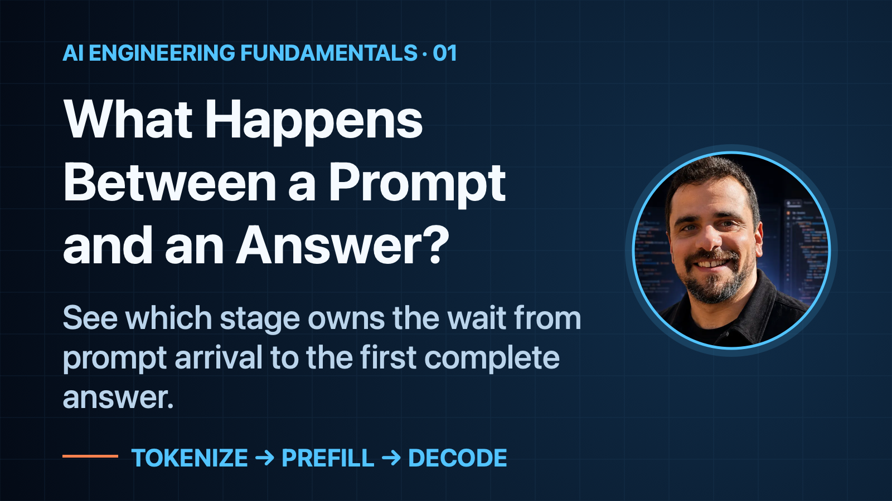
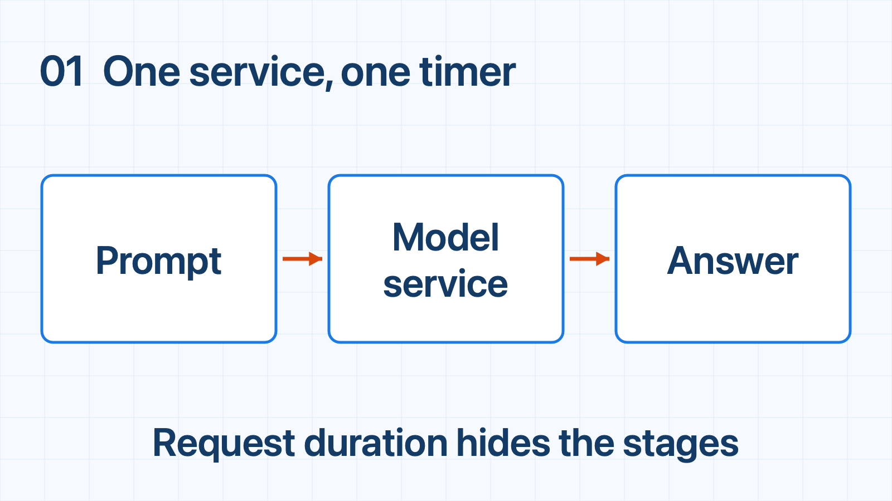
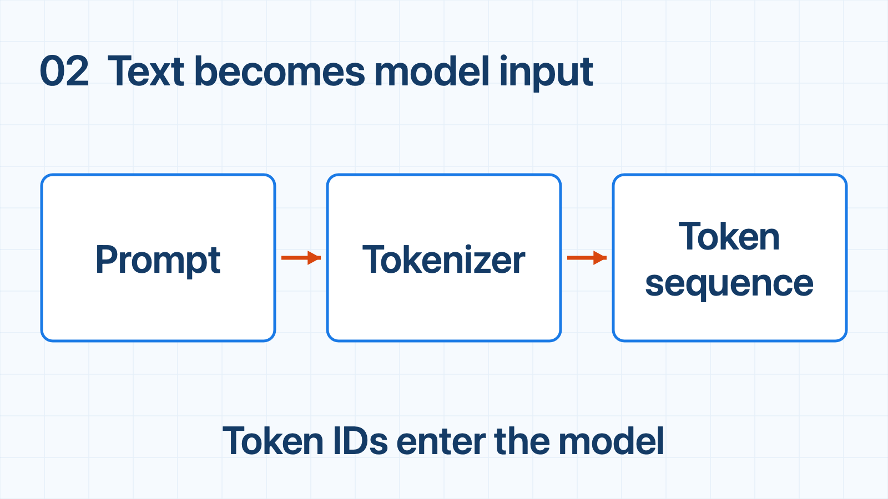
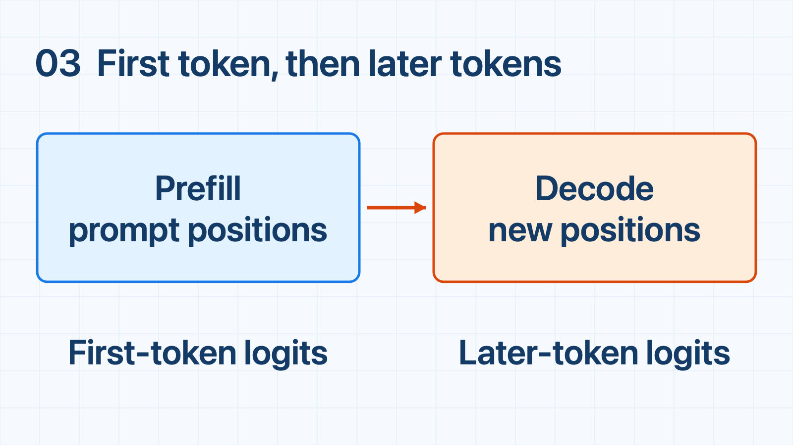
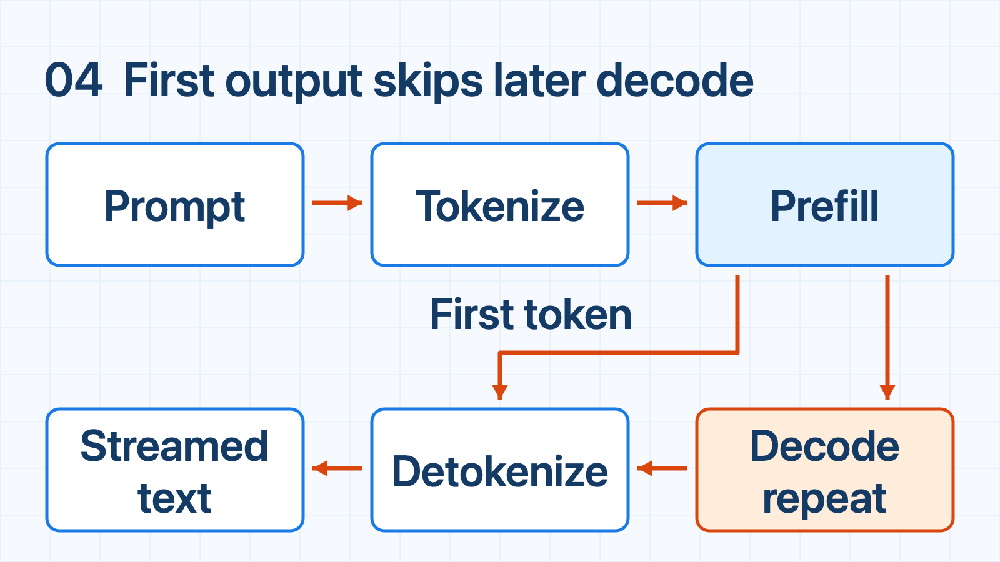

# What Happens Between a Prompt and an Answer?

*See which stage owns the wait from prompt arrival to the first complete answer.*

*Hero: one request, viewed as a sequence of engineering stages.*

## When to use this

*Recognize the situation, then choose what to check.*

## The question

An LLM request can feel like one operation: send text, wait, receive text. That mental model is convenient at the API boundary, but it hides several different kinds of work. A user may wait before seeing anything, then watch an answer arrive incrementally, and finally receive a completed string. Those waits do not all belong to the same stage.

The useful question is not “How fast is the model?” It is: **where does time go during this request?** Follow one request from input text to output text, without opening the transformer itself.

## Step 1 — The simple service

*Baseline: the request appears to be one operation.*

At the simplest level, an application sends a **prompt** to a model service. The service returns an **answer**. Your client does not need to know how the service schedules kernels, stores state, or chooses a device.

But this picture gives you only one timer: request duration. If that timer grows, it cannot tell you whether the service is preparing input, producing output, waiting in a queue, or converting the result to text. The next layer makes that hidden work visible.

## Step 2 — Text becomes tokens

*The input is first represented as tokens.*

Before model processing, a **tokenizer** maps the prompt’s text to a sequence of **tokens**. A token is a model-specific unit: it may represent part of a word, a whole short word, punctuation, or whitespace. The model operates on this sequence, not directly on the characters you see.

Tokenization is part of the request path and gives engineers a useful unit for reasoning about input size. The same visible length can produce different token sequences with different tokenizers, so character count alone does not describe the model’s work.

Later, **detokenization** converts generated tokens back into readable text. Both conversions are necessary at the service boundary.

## Step 3 — Prefill, then decode

*Prefill supplies the first output token; subsequent decode steps produce later tokens.*

The token sequence enters **prefill**: in the causal decoder considered here, the model processes the prompt, builds reusable attention state, and produces logits—the scores used to select the first output token. Its duration depends on the input, serving implementation, and workload sharing the hardware.

Subsequent **decode** steps consume generated tokens and predict later tokens. The model generates autoregressively: each new prediction depends on the sequence built so far. The answer is incremental rather than one simultaneous operation.

**Time to first token (TTFT)** measures the path to that first output. Label the observation boundary: server arrival → first output differs from client request-send → first received content, which includes network and client-facing buffering. Depending on the boundary, tokenization, queueing, and prefill contribute to the wait. Neither measurement describes the time to finish the answer. A response can start quickly yet take a long time to complete.

## Step 4 — The complete path

*The complete request path separates first-token work from generation work.*

Put the stages together: **prompt → tokenize → prefill**, then **first-token delivery and repeated decode → detokenize → streamed text**.

Prefill supplies the first output token; later decode steps supply the rest. Detokenization converts output incrementally, not only after decode finishes. A streaming chunk may contain multiple tokens or part of a text segment: client chunk gaps are not automatically model inter-token latency.

This path is a model for measurement, not a promise that every implementation exposes identical boundaries. Queues, batching, network transfer, streaming, and runtime overhead can add time around the stages. The bottleneck depends on the model, hardware, prompt and output lengths, and concurrent workload. Measure the stages rather than assign a universal cost to one of them.

That is why later articles isolate token context, prefill/decode, KV-cache memory, and scheduling. Each is a focused question inside the same request journey, not part of one “model latency” number.

## Engineering takeaway

- An LLM answer is a pipeline, not one indivisible operation.
- TTFT describes the path to the first visible token; the rest of the answer follows a different, repeated decode path.
- Name the stage that owns the wait before choosing what to change.

If your team needs help designing, implementing, or optimizing an AI or software system, email me at [bar.idan@gmail.com](mailto:bar.idan@gmail.com) to discuss a monthly programming-contractor retainer block.

## References

- [Hugging Face Transformers: Text generation strategies](https://huggingface.co/docs/transformers/main/en/generation_strategies) — autoregressive, token-by-token generation.
- [Hugging Face: How caching works](https://huggingface.co/docs/transformers/main/en/cache_explanation) — full-prompt logits followed by cached one-token calls.
- [vLLM: Metrics](https://docs.vllm.ai/en/latest/design/metrics/) — server arrival and first-output timing boundaries.
