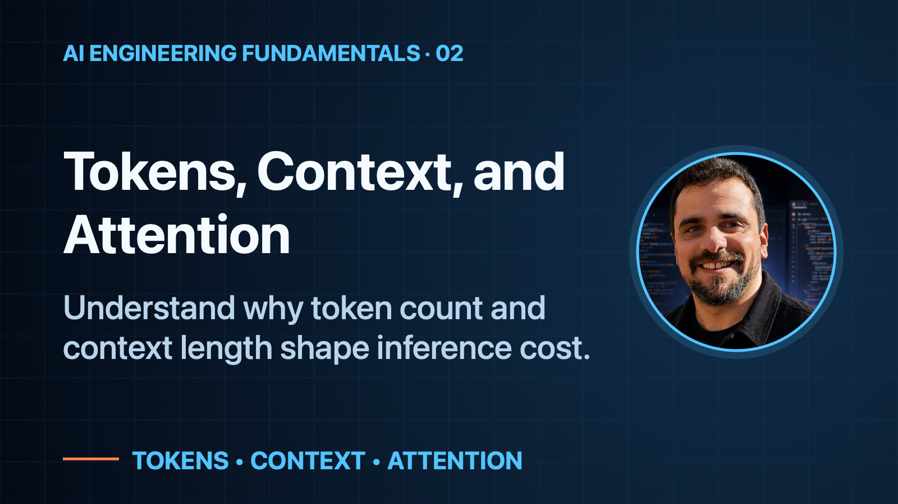
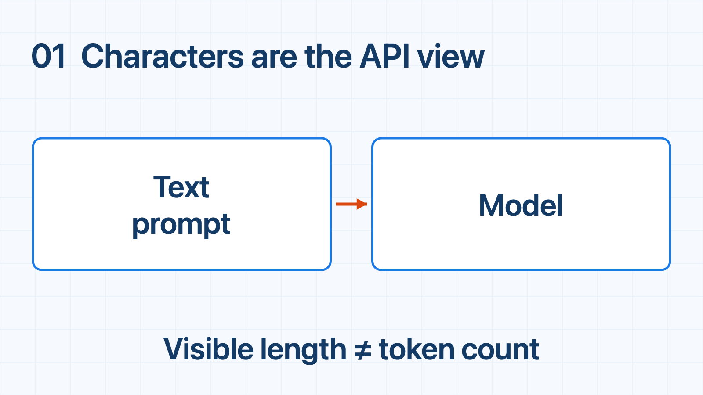
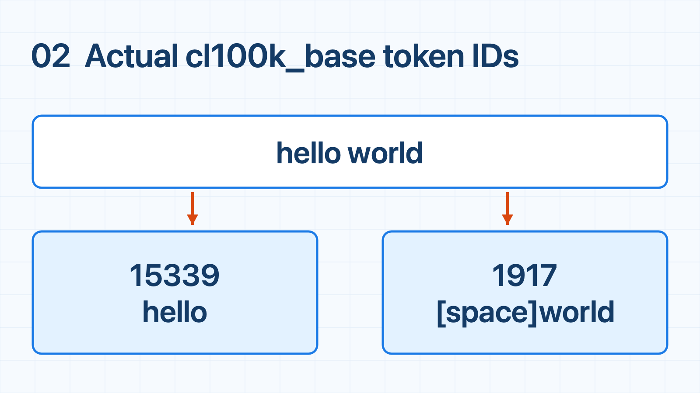
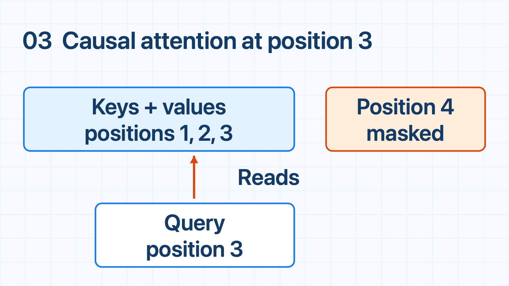
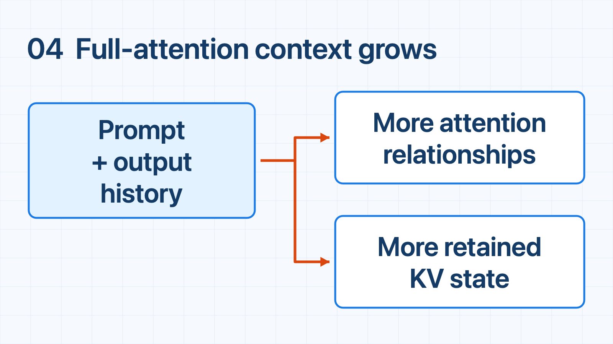

# Tokens, Context, and Attention

*Understand why token count and context length shape inference cost.*

## When to use this

*Recognize the situation, then choose what to check.*

## Your prompt fits. That doesn’t mean it’s helping.

When an LLM misses an important detail, the obvious fix is to give it more context.

Add another document. Keep more conversation history. Expand the system instructions.

The request still fits inside the context window, so it feels like a safe improvement.

But **fitting more information is not the same as using it well**. Extra context can add processing work and memory pressure without making the model more reliable at finding the detail that matters.

That leaves an engineering question: **what are we paying for when we make a prompt longer—and when is that extra work worthwhile?**

Tokens, context, and attention help explain the answer. Not as vocabulary to memorize, but as the mechanics behind the requests we build.

## Step 1 — Text enters the model

*Baseline: visible text enters the model.*

At the API boundary, you send text and receive a response. Inside the service, a **tokenizer** maps text into model-specific units called **tokens**.

Its vocabulary determines the boundaries: a word may become one token or several, and punctuation or whitespace can change the split. Budget with the serving endpoint’s tokenizer—not character count.

## Step 2 — Tokenization exposes the work units

*Tokenization exposes two real cl100k_base pieces: `hello` and `[space]world`; `[space]` marks a literal space.*

Take two strings with the same 11 characters: `status = ok` and `hello world`. OpenAI’s `cl100k_base` encoding produces 3 and 2 tokens respectively. These are raw-string counts, excluding chat-message formatting; another tokenizer may split them differently.

The sequence gives us a useful definition of **context**: the ordered tokens available for the current prediction. At the start, context may be the prompt. During generation, newly produced tokens join it; the input remains part of the history.

## Step 3 — Tokens form relationships

*Causal attention relates a position only to itself and permitted earlier positions.*

For each position, **attention** weighs available information. In the causal decoder considered here, a position attends only to itself and permitted earlier positions—not future tokens.

The standard labels are **query**, **key**, and **value**. A query is compared with keys; the resulting weights determine how much of the corresponding values contributes to a position’s representation. **Positional information** tells the model where tokens occur in the sequence, so the same tokens in a different order are not treated as identical input.

Appending future tokens therefore does not change earlier causal representations. That restriction lets a runtime reuse earlier keys and values during generation.

There is no universal cost formula. Architecture, attention variant, implementation, batching, and hardware all matter. The safe operational statement is narrower: increasing token sequence length generally increases prompt-processing work and serving state.

## Step 4 — Context grows during a request

*Adding context expands the serving burden before an answer is complete.*

Consider a conversation with a long system instruction, a user question, retrieved evidence, and a generated answer. The prompt starts with one sequence length. Retrieval can add tokens. Each generated token extends the history. The context budget must accommodate this combined sequence, and the runtime must manage request-dependent state while it grows.

That creates two related pressures. First, longer input can increase time to first token because more prompt material must be processed before generation begins. Second, full-attention sequences retain more generation state as they grow. Windowed attention can bound that history; preallocated caches can consume more capacity without increasing reserved bytes. Concurrent requests compete for this state budget while model weights remain unchanged.

More context may preserve useful instructions or evidence, but it can also carry irrelevant material, consume budget, and increase latency or memory pressure. The choice is not “maximize context.” Keep the information needed for the question, using truncation, summarization, or retrieval when appropriate; each trades detail for omission or complexity.

A context limit does not guarantee reliable recall. *Lost in the Middle* found that evidence position affected performance in its tested models and tasks—not a universal verdict on every current model. Evaluate your own evidence placements as well as token counts and serving behavior.

## Engineering takeaway

- Count tokens with the endpoint’s tokenizer; visible characters are only an approximate proxy.
- Context is an active sequence: attention relates positions, and generated history extends it.
- Longer context generally adds work and memory pressure, but precise scaling depends on architecture, runtime, batching, and hardware.

If your team needs help measuring token/context pressure and choosing a practical context strategy, email me at [bar.idan@gmail.com](mailto:bar.idan@gmail.com) to discuss a monthly programming-contractor retainer block.

## References

- [OpenAI tiktoken](https://github.com/openai/tiktoken) — executable model-specific tokenization; example reproduced with version 0.14.0.
- [Vaswani et al., “Attention Is All You Need”](https://arxiv.org/abs/1706.03762) — Q/K/V, positional information, and causal masking.
- [Liu et al., “Lost in the Middle”](https://arxiv.org/abs/2307.03172) — evidence-position sensitivity in evaluated long-context tasks.
