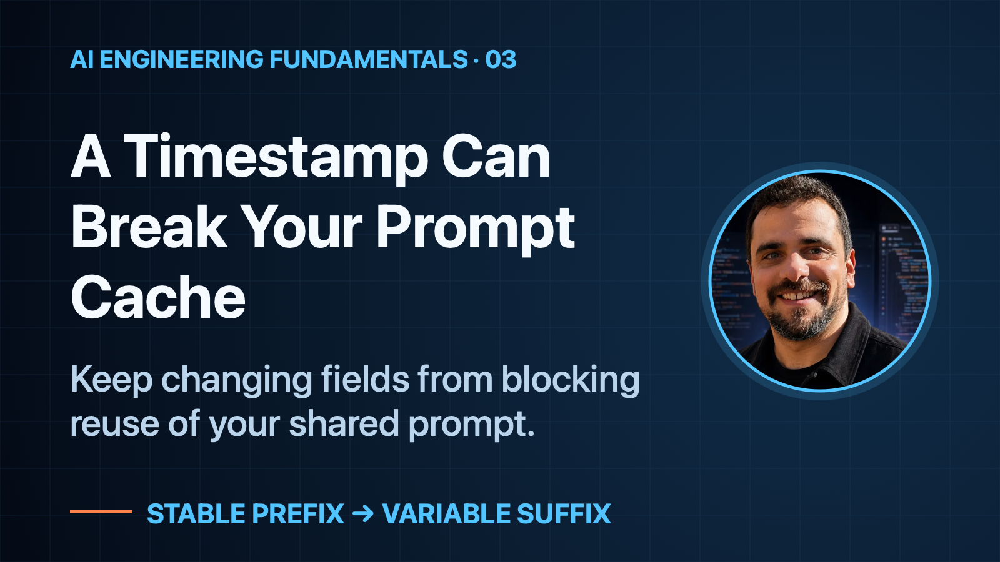
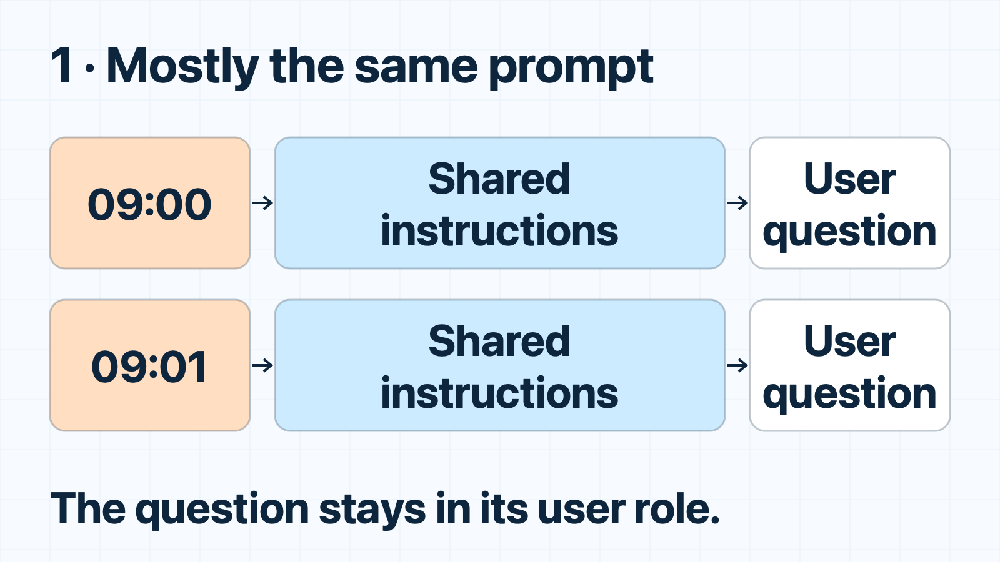
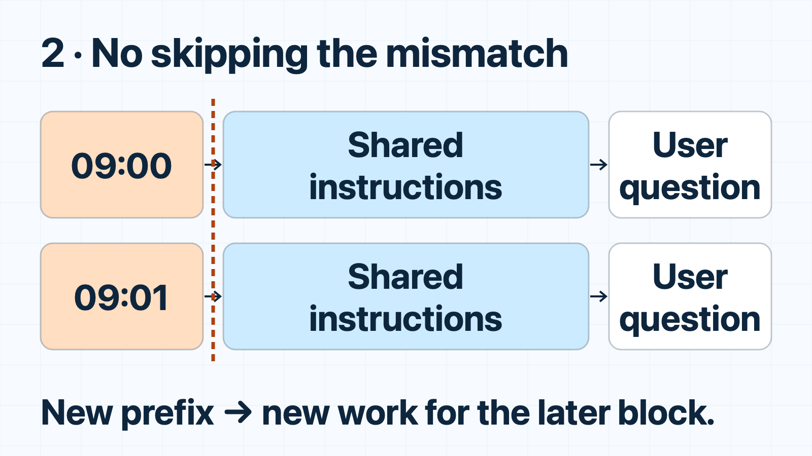
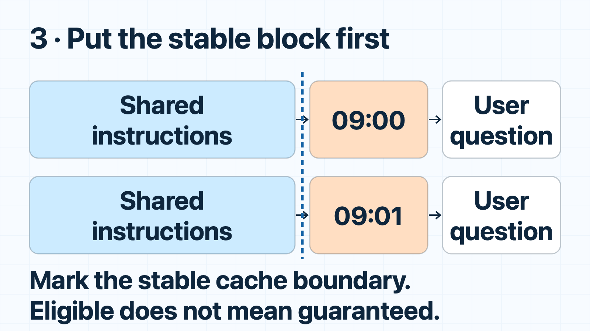
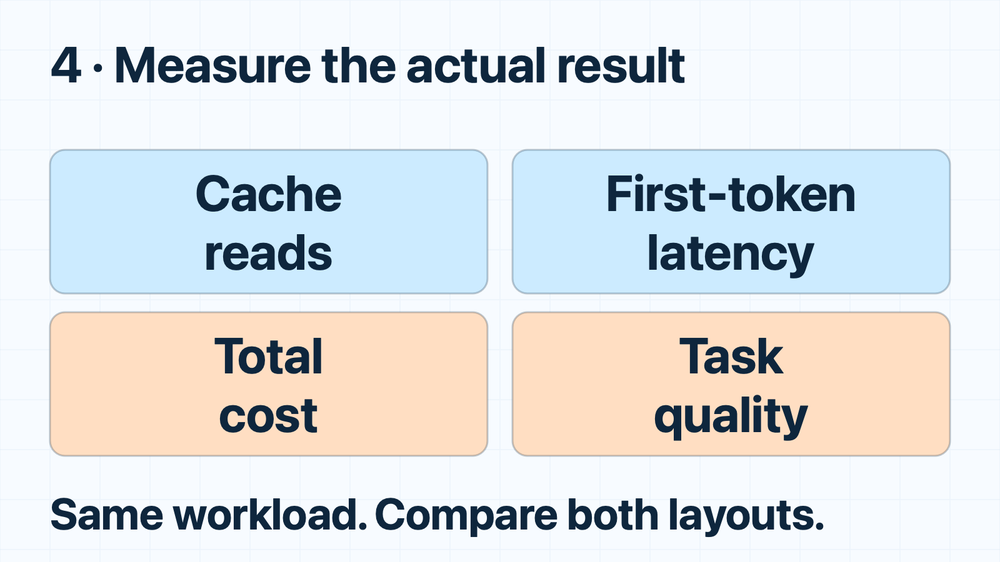

# A Timestamp Can Break Your Prompt Cache

*Keep changing fields from blocking reuse of your shared prompt.*

## When to use this

*Recognize the situation, then choose what to check.*

## Same handbook. Different question. Repeated work.

Imagine a customer-support assistant for an online store.

One customer asks whether they can return an opened product. Another asks whether their order will arrive before Friday. Different questions, but every request includes the same lengthy handbook: return policies, shipping rules, and instructions for answering customers.

That repeated context looks like an obvious candidate for prompt caching.

Yet the cache reads aren’t showing up.

Before changing models or shortening the handbook, you inspect how the application builds each request. Right at the top, before the shared instructions, sits a small line:

`Current time: 09:01`

On the previous request, it said `09:00`.

The timestamp belongs there somewhere—the assistant may need it. But its **position** matters. A prefix cache cannot skip that early difference and resume matching at the identical handbook below it.

**A tiny changing field can block reuse of a much larger, unchanged block.**

## Step 1 — bad for prefix reuse

Here is a shortened teaching example, not a live cache test.

**Trusted instruction message:**

    Current time: 09:01
    You help customers with orders.
    Returns: unopened items within 30 days.
    Ask for missing order details.

**Separate user message, unchanged in both versions:**

> Can I return an unopened item bought 12 days ago?

This prompt can produce a correct answer. But when the time changes, the later instructions no longer have the same prefix. Without reusable state, their input processing—**prefill**—must repeat.

*Baseline: a small changing field comes before a large repeated block.*

## Step 2 — the cache cannot skip the mismatch

A **prefix** is the beginning of a sequence. For the prefix-caching systems discussed here, reuse depends on a matching beginning, not a search for identical paragraphs anywhere in the request.

The state computed for the instruction block depends on preceding context. Change the earlier timestamp, and that later block no longer has the same prefix. Matching stops at the difference; it does not restart after it. Any eligible unchanged prefix before the difference may still be reusable.

OpenAI documents matching across the rendered prompt, while vLLM hashes blocks together with their preceding prefix. Different implementations, same practical warning: **a large identical suffix is not a reusable prefix**.

*The mismatch now explains why the later shared block cannot reuse its previous state.*

## Step 3 — move the variable field, not the trust boundary

**Better for reuse — the same trusted instruction message:**

    You help customers with orders.
    Returns: unopened items within 30 days.
    Ask for missing order details.
    Current time: 09:01

**Only the timestamp’s position changed.** The rules and user message did not. The stable beginning can now match across requests.

Keep roles unchanged: never freeze a necessary timestamp or promote user-controlled text into trusted instructions.

Ordering alone is not sufficient. For explicit caching, place the cache boundary at the end of the stable block, before the timestamp. Claude’s documentation shows why a boundary after changing content can produce repeated writes without useful reads. Check your provider’s current configuration rather than assuming caching is enabled or every prefix is saved.

A hit also requires a supported model, sufficient eligible length, compatible settings, and an available entry. Expiry, eviction, or routing can still cause misses.

*Reordering exposes a stable prefix; a cache boundary marks the region for reuse.*

## Step 4 — prove reuse without hiding regressions

Compare both layouts on representative questions with the same model, settings, and workload. Track initial cache writes separately from later reads; do not label a request “cold” merely because it ran first in your test.

Record cached-input tokens, client-observed time to first token, completion time, total request cost—including cache-write charges where applicable—and answer quality. OpenAI’s Responses API reports `usage.input_tokens_details.cached_tokens`; Claude reports `usage.cache_read_input_tokens`.

Reordering can affect model behavior. Include time-sensitive questions and instruction-following cases. Preserve tenant access controls and refresh changed reference material instead of serving stale text for a higher hit rate.

*The final step checks whether eligible reuse becomes a useful, correct improvement.*

## The rule worth keeping

**Stable first, variable later—where correctness allows it. Then verify the cache reads.**

This caches prompt-processing work, not answers. The model still processes the new suffix and generates a response. If output generation or queueing dominates, better prefix reuse may barely change the user’s wait.

If your team needs help diagnosing AI latency or cost, [email me](mailto:bar.idan@gmail.com) to discuss a monthly programming-contractor retainer block.

## Sources

- [OpenAI: Prompt caching](https://developers.openai.com/api/docs/guides/prompt-caching)
- [Claude: Prompt caching](https://platform.claude.com/docs/en/build-with-claude/prompt-caching)
- [vLLM: Automatic Prefix Caching](https://docs.vllm.ai/en/latest/design/prefix_caching/)
